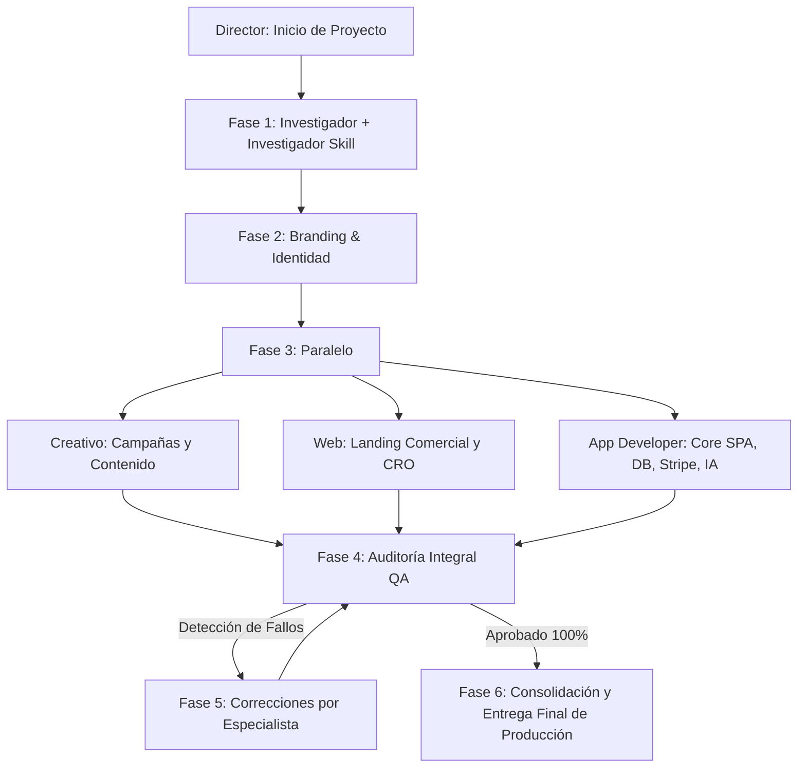

# Compra Captación - Sistema de Agentes de Desarrollo y Estándares de Ingeniería

Este documento define la estructura, el flujo operativo y los estándares de ciberseguridad del equipo de agentes especializados para el desarrollo y producción de **Compra Captación** (https://compracaptacion.com/).

---

## 🔒 Regla de Oro de Git y Despliegue en Producción
* **POLÍTICA ESTRICTA**: Ningún desarrollador o agente de IA autónomo debe subir cambios directos a producción ni ejecutar comandos de subida (`git push`, despliegues no autorizados) sin la **autorización explícita y manual del Director del Proyecto**.
* **Gestión de Dependencias**: Es obligatorio el uso de **`pnpm`** (`packageManager: pnpm@9.x`) en todos los subproyectos y utilidades de Node.js para prevenir dependencias fantasma e inyección lateral de librerías.

---

## 👥 Equipo de Agentes (.agents/agents/)

| Agente | Rol / Responsabilidad | Tipo | Modelo | Habilidades Clave (Skills) |
| :--- | :--- | :--- | :--- | :--- |
| **Director** | Coordinador general y consolidador. No ejecuta tareas de bajo nivel. | `mainAgent: true` | `pro` | `creador-de-agentes-captacion`, `saas-metrics`, `requesting-code-review` |
| **Investigador** | Análisis de mercado inmobiliario B2B en España, MLS y pricing. | `subagent: true` | `flash` | `real-estate-expert`, `real-estate-analyzer`, `saas-revenue-growth-metrics` |
| **Investigador Skill** | Análisis y validación de skills de https://skills.sh/. | `subagent: true` | `flash` | `skill-creator`, `creador-de-agentes-captacion` |
| **Branding** | Naming, propuesta única de valor e identidad visual. | `subagent: true` | `pro` | `copywriting`, `real-estate-expert`, `web-design-guidelines` |
| **Creativo** | Conceptos publicitarios, guiones, copies y campañas. | `subagent: true` | `pro` | `copywriting`, `cold-email`, `email-sequence`, `social-media` |
| **Web** | Landing page comercial, conversión (CRO) y SEO técnico. | `subagent: true` | `pro` | `frontend-design`, `web-design-guidelines`, `seo`, `programmatic-seo` |
| **App Developer** | Desarrollo de Core SPA, Leaflet maps, Stripe webhooks, Base de datos e IA Vera. | `subagent: true` | `pro` | `creador-de-agentes-captacion`, `frontend-design`, `api-design-principles`, `tdd` |
| **Auditor** | Testing funcional E2E, seguridad WAF, transacciones y control de calidad. | `subagent: true` | `pro` | `systematic-debugging`, `requesting-code-review`, `tdd`, `api-design-principles` |

---

## 🔄 Flujo de Trabajo Oficial (Orquestado por Director)

---

## 🛡️ Checklist de Ciberseguridad y Calidad (11 Criterios Obligatorios)

1. **Variables de Entorno**: Credenciales gestionadas mediante variables seguras. Archivo `.env` ignorado en Git y `.env.example` actualizado.
2. **Validación de Entradas (Inputs)**: Sanitización y validación estricta en todos los endpoints (`records.php`, `auth.php`, `credits.php`, etc.) para prevenir SQLi y XSS.
3. **Aislamiento y Prepared Statements en Base de Datos**: Uso exclusivo de sentencias preparadas (`PDO::prepare`) sin concatenación de cadenas SQL.
4. **Autenticación de Rutas**: Restricción estricta de rutas privadas y endpoints protegidos contra accesos no autenticados.
5. **Control de Roles en Servidor (RBAC)**: Validación de permisos en Backend (nunca depender únicamente de la interfaz visual del cliente).
6. **Whitelists de CORS y Cabeceras HTTP Seguras**: Encabezados `X-Content-Type-Options`, `X-Frame-Options`, `Content-Security-Policy` y CORS restrictivo configurados en servidor.
7. **Rate Limiting y Protección Fuerza Bruta**: Límite de intentos en autenticación y peticiones sensibles.
8. **Manejo Seguro de Errores**: Ocultación de trazas físicas, rutas de archivos y detalles internos de base de datos en respuestas JSON.
9. **Uso Obligatorio de `pnpm`**: Árbol de dependencias estricto y enlazado físico para evitar librerías maliciosas o dependencias fantasma.
10. **Auditoría Periódica de Dependencias**: Análisis de vulnerabilidades conocidas (`pnpm audit`).
11. **Exclusión de Datos Sensibles en Logs**: Prohibido registrar contraseñas, tokens de autenticación o información personal identificable (PII) en los logs.
12. **Protección Estricta de Credenciales y Prohibición de Autocompletado en Frontend**: Queda terminantemente prohibido exponer, precargar, sugerir, incrustar o mostrar credenciales, contraseñas en texto claro o botones de acceso rápido con contraseñas en cualquier formulario, modal o vista pública de la web. Todos los formularios de autenticación deben requerir siempre entrada manual y campos limpios.

---

## ⚡ Automatización Segura e Integración n8n
* **Webhooks Protegidos**: Recepción con token de autorización Bearer/Header.
* **Respuesta Asíncrona Rápida**: Respuesta 200/201 inmediata al frontend antes de procesar tareas en segundo plano (IA, emails).
* **Gestión Centralizada**: Credenciales administradas exclusivamente desde el gestor de credenciales nativo de n8n.

---

## 🛠️ Habilidades Instaladas en el Proyecto (`.agents/skills/`)
Se encuentran instaladas y disponibles las 25 habilidades modulares del ecosistema:
- `animation-principles`, `api-design-principles`, `azure-ai`, `cold-email`, `copywriting`, `creador-de-agentes-captacion`, `email-sequence`, `firebase-security-rules-auditor`, `firecrawl-seo-audit`, `frontend-design`, `funnel-architect`, `marketing-automation`, `programmatic-seo`, `real-estate-analyzer`, `real-estate-content-production`, `real-estate-expert`, `requesting-code-review`, `saas-metrics`, `saas-revenue-growth-metrics`, `seo`, `skill-creator`, `social-media`, `systematic-debugging`, `tdd`, `web-design-guidelines`.
