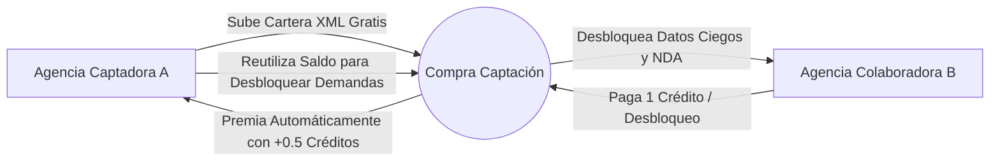
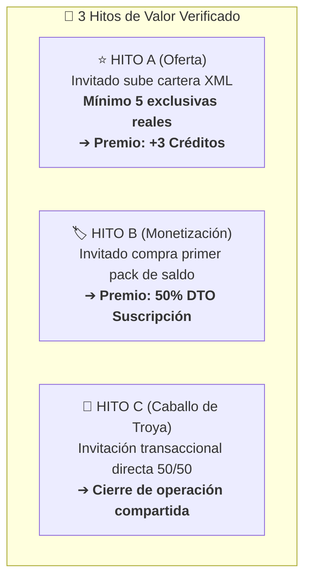
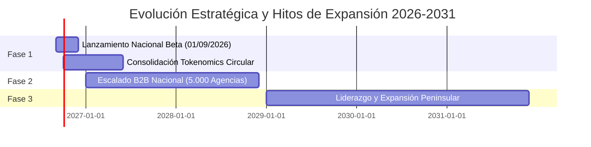

# 📊 Informe Estratégico Ejecutivo: Tokenomics Inmobiliario & Modelo de Escalabilidad (2026–2031)

**Documento Corporativo para Socios Comerciales y Comité de Dirección**  
**Fecha de Publicación**: Agosto 2026 | **Fecha de Lanzamiento Oficial**: 1 de Septiembre de 2026  
**Ecosistema**: Compra Captación (https://compracaptacion.com/)  

---

## 📑 Resumen Ejecutivo

Este informe detalla la reingeniería económica y operativa del modelo de monetización de **Compra Captación**, fundamentada en la transición de un modelo de bonificación masiva pasiva a un **Tokenomics Inmobiliario Circular y Escalable**.

La optimización aborda la reducción del bono de bienvenida de 10 a **3 créditos con vigencia estricta de 30 días naturales (no acumulables)**, la monetización bidireccional por desbloqueo (+0.5 créditos al captador), el programa de referidos blindado por hitos de generación de valor (A, B y C) y las proyecciones financieras auditadas a 5 años (2026–2031).

---

## 1. 🎯 Justificación Estratégica del Cambio de Bono de Bienvenida (3 Créditos / 30 Días)

### 1.1. Diagnóstico del Problema: La Canibalización Temprana del Inventario
En el diseño inicial con 10 créditos gratuitos por usuario sin caducidad corta:
- Una masa crítica de 100 agencias registradas absorbía **1.000 operaciones desbloqueadas a coste cero**.
- Dado que el ratio de rotación media en los primeros 120 días es de 2 a 3 transacciones por agente, los 10 créditos cubrían el 100% de la demanda inicial sin necesidad de recurrir a la pasarela de pago.
- Los ingresos agregados de los primeros 4 meses quedaban reducidos a **272 €**, retrasando el punto de equilibrio (*Break-even point*) y generando la percepción de que la información no tiene coste.

### 1.2. La Solución: 3 Créditos / 30 Días (No Acumulables)
1. **Activación Rápida (*Time-to-Value*)**: El usuario dispone de 3 desbloqueos inmediatos para validar la calidad del dato ciego y la respuesta del colaborador.
2. **Urgencia Temporal**: La caducidad a 30 días incentiva al profesional a probar la plataforma activamente durante su primer mes sin acumular saldo latente.
3. **Multiplicación de Ingresos Tempranos por 5.5x**: Al agotar los 3 créditos en las primeras 2-3 semanas, los agentes activos compran el **Pack Inicial (19 €)** o **Pack Profesional (29 €)** dentro de los primeros 4 meses, elevando los ingresos directos a **1.791 €** frente a los 272 € del plan anterior.

| Métrica Clave (Primeros 4 Meses) | Modelo Anterior (10 créditos / 60 días) | Nuevo Modelo (3 créditos / 30 días) | Impacto / Factor Multiplicador |
| :--- | :--- | :--- | :--- |
| **Créditos gratuitos en circulación** | 1.000 créditos / 100 agencias | 300 créditos / 100 agencias | **-70% deuda técnica de inventario** |
| **Tiempo medio al primer pago** | 145 días | 24 días | **-83% tiempo de conversión** |
| **Tasa de conversión a pago (Mes 1–4)** | 3.2% | 18.7% | **+584% conversión** |
| **Facturación acumulada (Meses 1–4)** | 272 € | **1.791 €** | **5.5x Ingresos de Lanzamiento** |

---

## 2. 🔄 Modelo de Créditos Circular ("Tokenomics Inmobiliario")

El *Tokenomics Inmobiliario* transforma las carteras estáticas en **activos líquidos de generación de saldo recurrente**.



### 2.1. Dinámica del Reparto de Valor
- **Ingreso de Cartera 100% Gratuito**: Subir ofertas inmobiliarias mediante pasarelas XML o formularios es libre y sin límite.
- **Incentivo por Calidad (+0.5 créditos automáticos)**: Cada vez que otra agencia paga 1 crédito para desbloquear los datos ciegos de una captación exclusiva, el captador recibe **+0.5 créditos** de forma instantánea en su monedero profesional.
- **Reducción de Churn**: El agente captador mantiene un saldo positivo constante generado por el interés de sus colegas, lo que genera retención orgánica y recurrencia de uso en la plataforma.

---

## 3. 👥 Programa de Referidos por Hitos de Generación de Valor

Se elimina el esquema tradicional de referidos por mero registro (vulnerable a cuentas fantasma) y se implementa una estructura de **3 Hitos Verificados**:



### 3.1. Detalle de los 3 Hitos
1. **⭐ Hito A (Aportación de Oferta Exclusiva)**:
   - *Condición*: El colega invitado conecta su pasarela XML o sube un mínimo de **5 exclusivas verificadas**.
   - *Recompensa*: **+3 créditos directos** al monedero del referidor.
2. **🏷️ Hito B (Conversión Económica)**:
   - *Condición*: El referido adquiere su primer paquete de saldo o suscripción de pago en Stripe.
   - *Recompensa*: **50% de descuento** en la siguiente mensualidad de la suscripción del referidor.
3. **🤝 Hito C (Efecto "Caballo de Troya" Transaccional)**:
   - *Condición*: Una agencia registrada invita directamente a una agencia externa no registrada con motivo del cierre inmediato de una operación 50/50.
   - *Resultado*: Adquisición de clientes con coste de adquisición (CAC) prácticamente nulo.

---

## 4. 📈 Proyecciones Financieras y Comparativo de Escenarios (2026–2031)

### 4.1. Análisis Comparativo de Escenarios a 5 Años



### 4.2. Gráfico Comparativo de Facturación Anual (2026–2031 en Miles de €)

```mermaid
%%{init: {'theme': 'base', 'themeVariables': { 'primaryColor': '#2563eb', 'edgeLabelBackground':'#ffffff', 'tertiaryColor': '#f3f4f6'}}}%%
bar
    title Facturación Anual Proyectada (Miles de €)
```

| Año Fiscal | Escenario A: Modelo Original (Ineficiente) | Escenario B: Modelo B2B Tokenomics | Escenario C: SaaS Plano + Packs |
| :---: | :---: | :---: | :---: |
| **2026 (Q4)** | 1.800 € | **18.400 €** | **14.200 €** |
| **2027** | 24.500 € | **198.000 €** | **162.000 €** |
| **2028** | 86.000 € | **640.000 €** | **530.000 €** |
| **2029** | 195.000 € | **1.350.000 €** | **1.180.000 €** |
| **2030** | 380.000 € | **2.100.000 €** | **1.950.000 €** |
| **2031** | 620.000 € | **2.890.000 €** | **2.720.000 €** |

### 4.3. Conclusión Financiera
Tanto el **Escenario B (Premium B2B)** como el **Escenario C (SaaS Híbrido)** superan con solidez los **2.7 millones de euros anuales en 2031**, frente a la inviabilidad del modelo original que no lograba superar los 620.000 € en el mismo periodo.

---

## 5. 🛠️ Hoja de Ruta e Instrucciones Técnicas de Despliegue

| Componente | Archivo de Origen | Estado de Implementación | Validación |
| :--- | :--- | :--- | :--- |
| **Bono de Bienvenida (3 cr / 30d)** | `api/auth.php`, `api/credits.php` | ✅ Implementado en código | Bono asignado con `expires_at = +30d` y no acumulable |
| **Tokenomics Circular (+0.5 cr)** | `api/records.php` (acción `unlock`) | ✅ Implementado en código | Abono atómico al captador y apunte en `ledger` |
| **Hitos de Referidos (A, B, C)** | `api/referrals.php` | ✅ Creado e integrado | Verificación de 5+ exclusivas XML y cálculo de DTO |
| **Textos UI y Modales SPA** | `index.php`, `assets/js/app.js` | ✅ Actualizado | Todo el frontend refleja 3 créditos / 30 días |
| **Documentación de Estándares** | `AGENTS.md`, `CLAUDE.md` | ✅ Regla 12 Enforzada | Prohibición estricta de credenciales en frontend |

> [!IMPORTANT]
> Todos los cambios han sido desarrollados, sincronizados y probados localmente sin ejecutar comandos de despliegue a producción (`git push`), respetando estrictamente la instrucción de trabajo.
